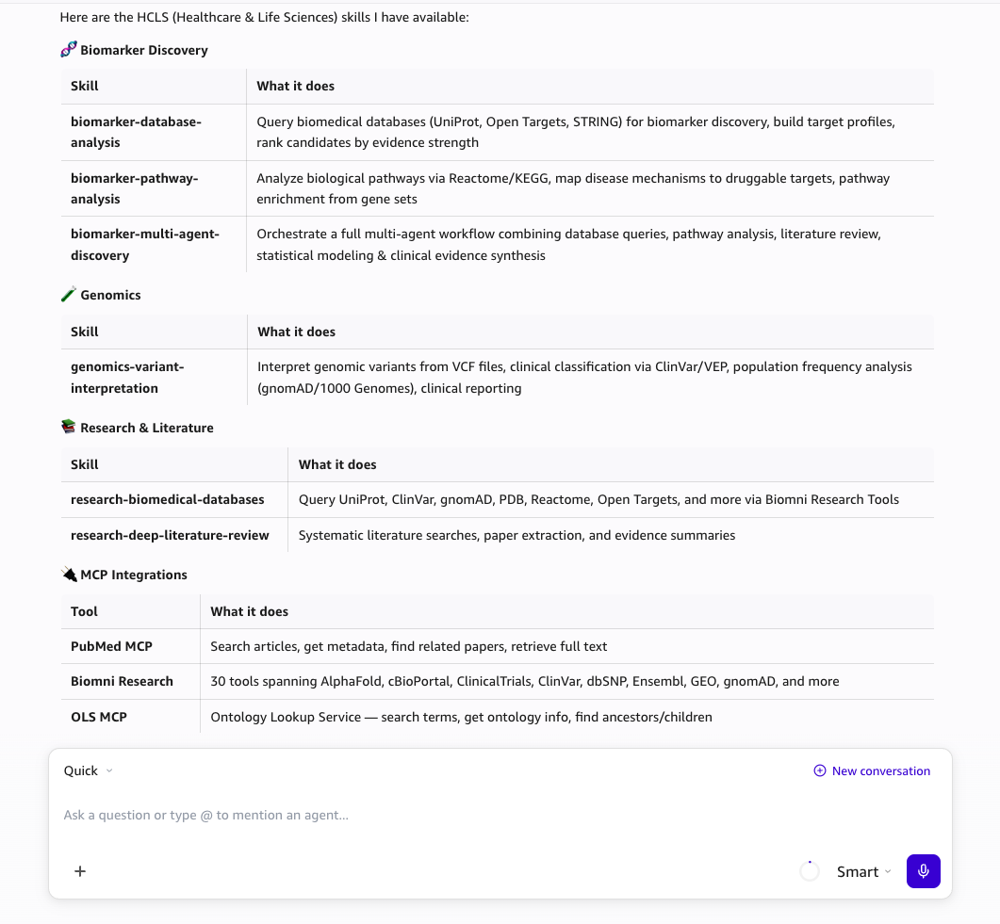

# Amazon Quick - HCLS Toolkit Connection Guide

Connect the HCLS MCP servers and skills to Amazon Quick so you can ask natural biomedical questions without naming servers or tools.

## Prerequisites

- Amazon Quick installed
- AWS CLI configured (for token generation)
- Deployed Biomni Gateway and/or OLS Runtime (see `mcp-servers/` for deployment)

## Quick Setup

### Step 1: Install Skills

Skills teach Amazon Quick *which tools to use* for different biomedical questions. Install them first:

1. Open Amazon Quick
2. Go to **Settings > Skills > Add Skill**
3. Add each skill file from the `skills/` directory:

| Skill | File Path | What it teaches |
|-------|-----------|-----------------|
| Research Biomedical Databases | `skills/research-biomedical-databases/SKILL.md` | Query 30+ biomedical databases via Biomni tools |
| Biomarker Pathway Analysis | `skills/biomarker-pathway-analysis/SKILL.md` | Biological pathway queries, enrichment analysis |
| Biomarker Database Analysis | `skills/biomarker-database-analysis/SKILL.md` | Biomarker discovery, target profiles |
| Deep Literature Review | `skills/research-deep-literature-review/SKILL.md` | Systematic literature search and evidence synthesis |
| Genomics Variant Interpretation | `skills/genomics-variant-interpretation/SKILL.md` | VCF interpretation, pathogenicity classification |

Alternatively, copy skills to the Amazon Quick skills directory:

```bash
cp -r skills/ ~/.quickwork/skills/
```

### Step 2: Verify Skills Are Installed

Ask Amazon Quick:

> "What HCLS skills do you have available?"

It should list biomedical database research, variant interpretation, ontology lookup, pathway analysis, and the connected MCP integrations:



### Step 3: Get Authentication Tokens

Tokens expire in 60 minutes. Run before configuring:

```bash
export AWS_PROFILE=<your-profile>
export AWS_REGION=us-west-2

# Biomni Research Tools (30+ biomedical database tools)
source mcp-servers/agentcore-gateway/biomni-research-tools/get-token.sh

# Ontology Lookup Service (OLS terminology search)
source mcp-servers/agentcore-runtime/ontology-lookup-service/get-token.sh
```

### Step 4: Add MCP Servers

1. Open Amazon Quick
2. Go to **Settings > Capabilities > Add MCP Server**
3. Add each server:

| Server | Transport | URL | Authorization Header |
|--------|-----------|-----|---------------------|
| Biomni Research | HTTP | `$BIOMNI_GATEWAY_URL` | `Bearer $BIOMNI_MCP_TOKEN` |
| Ontology Lookup | HTTP | `$OLS_MCP_URL` | `Bearer $OLS_MCP_TOKEN` |
| AWS Knowledge | HTTP | `https://knowledge-mcp.global.api.aws` | (none) |
| PubMed | HTTP | `https://pubmed.mcp.claude.com/mcp` | (none) |
| Open Targets | HTTP | `https://mcp.platform.opentargets.org/mcp` | (none) |

For stdio-based servers:

| Server | Command |
|--------|---------|
| AWS HealthOmics | `uvx awslabs.aws-healthomics-mcp-server@latest` |

### Step 5: Test

Ask these natural questions. Skills route Amazon Quick to the correct tools automatically:

| Category | Example Question | Expected Behavior |
|----------|-----------------|-------------------|
| agentcore-gateway | "Look up human insulin protein and give me the UniProt ID" | Uses Biomni → UniProt tools, returns P01308 |
| agentcore-runtime | "What are the children of seizure (HP:0001250) in HPO?" | Uses OLS → get_term_children, returns seizure subtypes |
| aws-public | "Find AWS documentation about Bedrock AgentCore" | Uses AWS Knowledge tools, returns doc links |
| third-party | "What diseases are associated with EGFR?" | Uses Open Targets tools, returns cancer associations |

You should NOT need to name the MCP server or tool — the skill handles routing.

## Token Refresh

Tokens expire after 60 minutes. To refresh:

1. Re-run the `get-token.sh` script for the expired server
2. Update the Authorization header in **Settings > Capabilities** with the new token

## Troubleshooting

| Issue | Cause | Fix |
|-------|-------|-----|
| "No tools loaded" | Token expired or auth header not passed | Refresh token, re-paste in settings |
| 401 Unauthorized | Token expired | Get a fresh token and update the Authorization header |
| Timeout on first call | AgentCore cold start | Wait ~30-60s, retry — subsequent calls are fast |

## Reference

- Public MCP servers (AWS Knowledge, PubMed, Open Targets) require no authentication
- Biomni and OLS tokens are Cognito M2M tokens valid for 60 minutes
